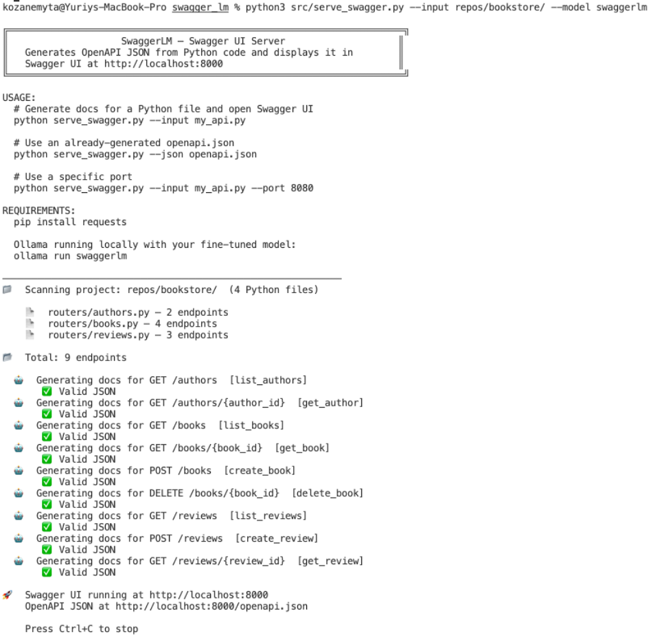
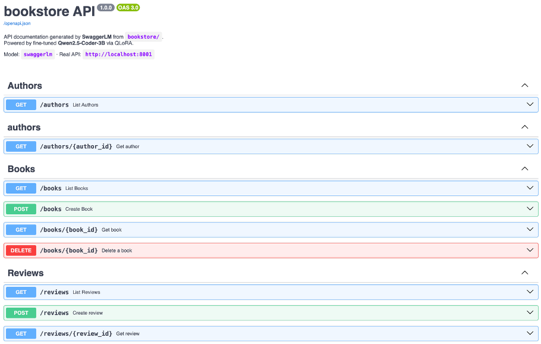
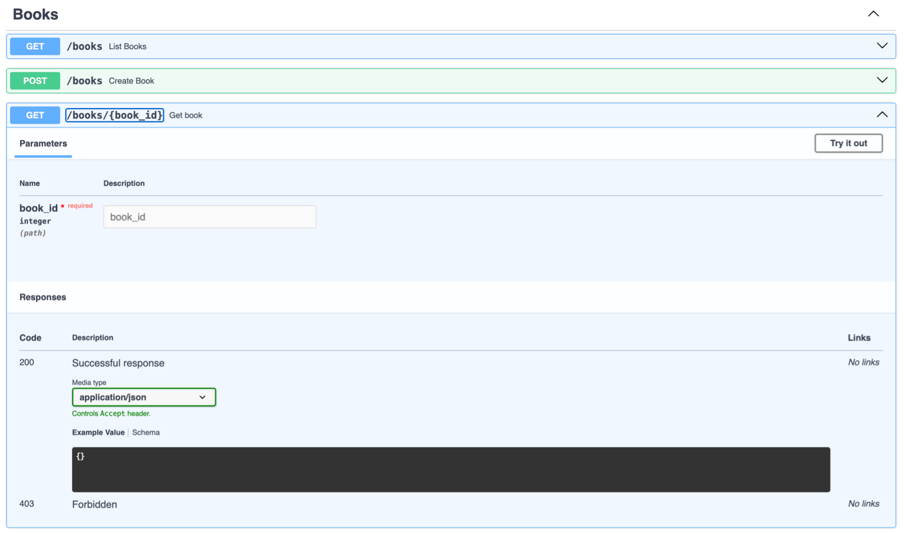

# ⚡ SwaggerLM

> Локальна система автоматичної генерації OpenAPI документації з вихідного коду FastAPI-проєктів на основі тонко налаштованої мовної моделі Qwen2.5-Coder-3B.

---

## 👤 Автор

- **ПІБ**: Брославський Юрій Романович
- **Група**: ФеП-42
- **Керівник**: Ляшкевич В. Я.
- **Дата виконання**: 01.06.2026

---

## 📌 Загальна інформація

- **Тип проєкту**: CLI-інструмент + веб-інтерфейс (Swagger UI)
- **Мова програмування**: Python 3.11
- **Базова модель**: Qwen2.5-Coder-3B-Instruct
- **Метод тонкого налаштування**: QLoRA (4-bit NF4)
- **Платформа інференсу**: Ollama
- **Датасет**: 8 499 записів (GitHub + APIs.guru)

---

## 🧠 Опис функціоналу

- 🔍 Автоматичний аналіз Python-файлів та мульти-файлових проєктів через AST-парсинг
- 🤖 Генерація OpenAPI JSON-документації для кожного FastAPI endpoint за допомогою fine-tuned LLM
- 📄 Збирання повної OpenAPI 3.0 специфікації з summary, parameters, requestBody, responses та tags
- 🌐 Візуалізація згенерованої документації через вбудований Swagger UI
- 💾 Збереження специфікації у файл `openapi.json` для подальшого використання
- 🔒 Повністю локальна робота — жодні дані не передаються на зовнішні сервери

---

## 🧱 Структура проєкту

```
swagger_lm/
├── src/
│   ├── serve_swagger.py        # Головний скрипт: аналіз + генерація + Swagger UI
│   ├── swagger_miner.py        # Збір даних з GitHub-репозиторіїв
│   ├── apis_guru_miner.py      # Збір даних з каталогу APIs.guru
│   ├── get_needed_data.py      # Балансування датасету по провайдерах
│   ├── splitter.py             # Розподіл на train/val вибірки
├── repos/
│   └── bookstore/              # Демо-проєкт для тестування
│       ├── main.py
│       └── routers/
│           ├── books.py        # 4 endpoints
│           ├── reviews.py      # 3 endpoints
│           └── authors.py      # 2 endpoints
├──results/
│   └── вивід файлів
├──screenshots/
│   └── скріншоти результатів
├── Modelfile                   # Конфігурація моделі для Ollama
├── docker-compose.yml          # Docker Compose конфігурація
├── requirements.txt
└── README.md
```

---

## ▶️ Як запустити проєкт

### 1. Встановлення Ollama

```bash
# macOS
brew install ollama

# Linux
curl -fsSL https://ollama.com/install.sh | sh
```

Перевірка:
```bash
ollama --version
```

### 2. Реєстрація моделі SwaggerLM

Розмістіть файл `swaggerlm_q4.gguf` та `Modelfile` в одному каталозі, після чого:

```bash
ollama create swaggerlm -f Modelfile
```

Перевірка:
```bash
ollama list
# Має з'явитися: swaggerlm
```

### 3. Встановлення Python-залежностей

```bash
pip install requests
```

### 4. Запуск

```bash
# Генерація документації для одного файлу
python src/serve_swagger.py --input my_api.py

# Сканування цілого проєкту
python src/serve_swagger.py --input repos/bookstore/

# Збереження специфікації у файл
python src/serve_swagger.py --input repos/bookstore/ --save openapi.json

# Завантаження готової специфікації
python src/serve_swagger.py --json openapi.json

# Зміна порту
python src/serve_swagger.py --input repos/bookstore/ --port 8080
```

Після запуску Swagger UI автоматично відкриється у браузері за адресою `http://localhost:8000`.

---

## 🐳 Запуск через Docker (альтернативний)

```bash
docker compose up
```

Система автоматично підніме Ollama та веб-сервер SwaggerLM. Swagger UI буде доступний за адресою `http://localhost:8000`.

Зупинка:
```bash
docker compose down
```

> ⚠️ Docker-версія працює лише на CPU. Для GPU-інференсу рекомендується локальне розгортання.

---

## 📊 Результати тестування

Порівняння на демо-проєкті bookstore (9 endpoints):

| Критерій | Base Qwen 3B | Llama 3 8B | SwaggerLM 3B |
|---|---|---|---|
| Успішних endpoint | 0/9 | 1/9 | **9/9** |
| Структура операції | невалідна | вкладений spec | ✅ коректна |
| Parameters з типами | ❌ | ❌ | ✅ |
| Response schema | ❌ | ✅ деталізована | ⚠️ type: object |
| Tags | ❌ | ❌ | ✅ |
| requestBody (POST) | ❌ | ❌ | ✅ |

---

## 🧪 Технічні деталі тренування

| Параметр | Значення |
|---|---|
| Базова модель | Qwen2.5-Coder-3B-Instruct |
| Метод | QLoRA (4-bit NF4) |
| LoRA ранг | 16 |
| LoRA alpha | 16 |
| Target modules | q_proj, k_proj, v_proj, o_proj, gate_proj, up_proj, down_proj |
| Тренованих параметрів | ~42M (< 2%) |
| Датасет | 8 074 train / 425 val |
| Епохи | 1 |
| Batch size | 2 × 8 gradient accumulation = 16 |
| Learning rate | 5e-5 (cosine scheduler) |
| Фінальний loss | ~0.42 (train ≈ eval) |
| Час тренування | ~40 хв на NVIDIA T4 (Google Colab) |
| Формат експорту | GGUF Q4_K_M (~2 GB) |

---
## 📷 Скріншоти
 
### Термінал — сканування проєкту та генерація
 

 
### Swagger UI — згенерована документація
 

 
### Swagger UI — деталізований endpoint
 


---
 
## 🧾 Використані джерела
 
### Наукові конференції та журнали
1. Grynets O., Lyashkevych V. Unified Architecture Metamodel of Information Systems Developed by Generative AI. arXiv preprint, 2026. [arXiv:2604.00171](https://arxiv.org/abs/2604.00171)
2. Radford A., Wu J., Child R., Luan D., Amodei D., Sutskever I. Language Models are Unsupervised Multitask Learners. OpenAI Technical Report, 2019. [URL](https://openai.com/research/better-language-models)
3. Vaswani A., Shazeer N., Parmar N. et al. Attention Is All You Need. NeurIPS, 2017. [arXiv:1706.03762](https://arxiv.org/abs/1706.03762)
4. Devlin J., Chang M.-W., Lee K., Toutanova K. BERT: Pre-training of Deep Bidirectional Transformers for Language Understanding. NAACL-HLT 2019. [URL](https://aclanthology.org/N19-1423/)
5. Houlsby N., Giurgiu A., Jastrzębski S. et al. Parameter-Efficient Transfer Learning for NLP. ICML 2019. [arXiv:1902.00751](https://arxiv.org/abs/1902.00751)
6. Brown T. B., Mann B., Ryder N. et al. Language Models are Few-Shot Learners. NeurIPS, 2020. [arXiv:2005.14165](https://arxiv.org/abs/2005.14165)
7. Papineni K., Roukos S., Ward T., Zhu W.-J. BLEU: a Method for Automatic Evaluation of Machine Translation. ACL 2002. [URL](https://aclanthology.org/P02-1040/)
8. Feng Z., Guo D., Tang D. et al. CodeBERT: A Pre-Trained Model for Programming and Natural Languages. Findings of EMNLP 2020. [URL](https://aclanthology.org/2020.findings-emnlp.139/)
9. Wolf T., Debut L., Sanh V. et al. Transformers: State-of-the-Art Natural Language Processing. EMNLP 2020: System Demonstrations. [URL](https://aclanthology.org/2020.emnlp-demos.6/)
10. Wang Y., Wang W., Joty S., Hoi S. C. H. CodeT5: Identifier-aware Unified Pre-trained Encoder-Decoder Models for Code Understanding and Generation. EMNLP 2021. [URL](https://aclanthology.org/2021.emnlp-main.685/)
11. Lu S., Guo D., Ren S. et al. CodeXGLUE: A Machine Learning Benchmark Dataset for Code Understanding and Generation. NeurIPS 2021. [arXiv:2102.04664](https://arxiv.org/abs/2102.04664)
12. Guo D., Ren S., Lu S. et al. GraphCodeBERT: Pre-training Code Representations with Data Flow. ICLR 2021. [arXiv:2009.08366](https://arxiv.org/abs/2009.08366)
13. Ahmad W. U., Chakraborty S., Ray B., Chang K.-W. Unified Pre-training for Program Understanding and Generation. NAACL 2021. [arXiv:2103.06333](https://arxiv.org/abs/2103.06333)
14. Hu E. J., Shen Y., Wallis P. et al. LoRA: Low-Rank Adaptation of Large Language Models. ICLR 2022. [arXiv:2106.09685](https://arxiv.org/abs/2106.09685)
15. Dettmers T., Pagnoni A., Holtzman A., Zettlemoyer L. QLoRA: Efficient Finetuning of Quantized LLMs. NeurIPS 2023. [arXiv:2305.14314](https://arxiv.org/abs/2305.14314)
16. Zheng L., Chiang W.-L., Sheng Y. et al. Judging LLM-as-a-Judge with MT-Bench and Chatbot Arena. NeurIPS 2023. [arXiv:2306.05685](https://arxiv.org/abs/2306.05685)
17. Grynets O., Orliansky M., Lyashkevych V. et al. Fine-tuned LLM-based Code Migration Framework. arXiv preprint, 2024. [arXiv:2512.13515](https://arxiv.org/abs/2512.13515)
### Статті наукових видань
18. Бідочко А. Використання великих мовних моделей для генерування програмного коду на основі доменно-специфічних мов. Вісник ХНУ. Технічні науки, 2024. [URL](https://journals.khnu.km.ua/vestnik/?p=18812)
19. Доскач Д.Я. Застосування великих мовних моделей в оптимізації процесу е-рекрутингу. Вісник ХНУ. Технічні науки, 2024. [URL](https://heraldts.khmnu.edu.ua/index.php/heraldts/article/view/89)
20. Глибовейь А. М., Дубовик А. В., Афонін А. О. Програмна система класифікації текстів на основі машинного навчання та рекурентної нейронної мережі. Наукові записки НаУКМА. Комп'ютерні науки, Том 8, 2025. [URL](https://nrpcomp.ukma.edu.ua/article/view/344656)
### Препринти
21. Chen M., Tworek J., Jun H. et al. Evaluating Large Language Models Trained on Code. arXiv, 2021. [arXiv:2107.03374](https://arxiv.org/abs/2107.03374)
22. Ren S., Guo D., Lu S. et al. CodeBLEU: a Method for Automatic Evaluation of Code Synthesis. arXiv, 2020. [arXiv:2009.10297](https://arxiv.org/abs/2009.10297)
23. Li R., Ben Allal L., Zi Y. et al. StarCoder: may the source be with you! arXiv, 2023. [arXiv:2305.06161](https://arxiv.org/abs/2305.06161)
24. Touvron H., Martin L., Stone K. et al. Llama 2: Open Foundation and Fine-Tuned Chat Models. arXiv, 2023. [arXiv:2307.09288](https://arxiv.org/abs/2307.09288)
25. Rozière B., Gehring J., Gloeckle F. et al. Code Llama: Open Foundation Models for Code. arXiv, 2023. [arXiv:2308.12950](https://arxiv.org/abs/2308.12950)
26. Hui B., Yang J., Cui Z. et al. Qwen2.5-Coder Technical Report. arXiv, 2024. [arXiv:2409.12186](https://arxiv.org/abs/2409.12186)
27. Qwen Team. Qwen2.5 Technical Report. arXiv, 2024. [arXiv:2412.15115](https://arxiv.org/abs/2412.15115)
28. Zan D., Chen B., Zhang F. et al. Large Language Models Meet NL2Code: A Survey. ACL 2023. [arXiv:2212.09420](https://arxiv.org/abs/2212.09420)
29. Grynets O., Lyashkevych V., Leschyshyn M. Fine-tuned LLM-based Code Migration Framework. [DOI:10.48550/arXiv.2512.13515](https://doi.org/10.48550/arXiv.2512.13515)
30. Grynets O., Lyashkevych V. Unified Architecture Metamodel of Information Systems Developed by Generative AI. [DOI:10.48550/arXiv.2604.00171](https://doi.org/10.48550/arXiv.2604.00171)
### Електронні ресурси
31. OpenAPI Initiative. [OpenAPI Specification v3.1.0](https://spec.openapis.org/oas/v3.1.0.html), 2021.
32. JSON Schema Specification. [json-schema.org](https://json-schema.org/specification), 2020.
33. Ramírez S. [FastAPI Documentation](https://fastapi.tiangolo.com/), 2019–2026.
34. Swagger / SmartBear Software. [Swagger UI](https://swagger.io/tools/swagger-ui/).
35. [APIs.guru](https://apis.guru/) — Wikipedia of Web APIs.
36. Mangrulkar S., Gugger S., Debut L. et al. [PEFT: Parameter-Efficient Fine-Tuning](https://github.com/huggingface/peft). GitHub, 2022.
37. Dettmers T. [bitsandbytes](https://github.com/bitsandbytes-foundation/bitsandbytes). GitHub, 2022.
38. Han D. [Unsloth: Finetune LLMs 2-5x faster](https://github.com/unslothai/unsloth). GitHub, 2024.
39. Ollama. [Ollama: Get up and running with LLMs](https://github.com/ollama/ollama). GitHub, 2023–2026.
40. Biewald L. [Experiment Tracking with Weights and Biases](https://www.wandb.ai/). 2020.